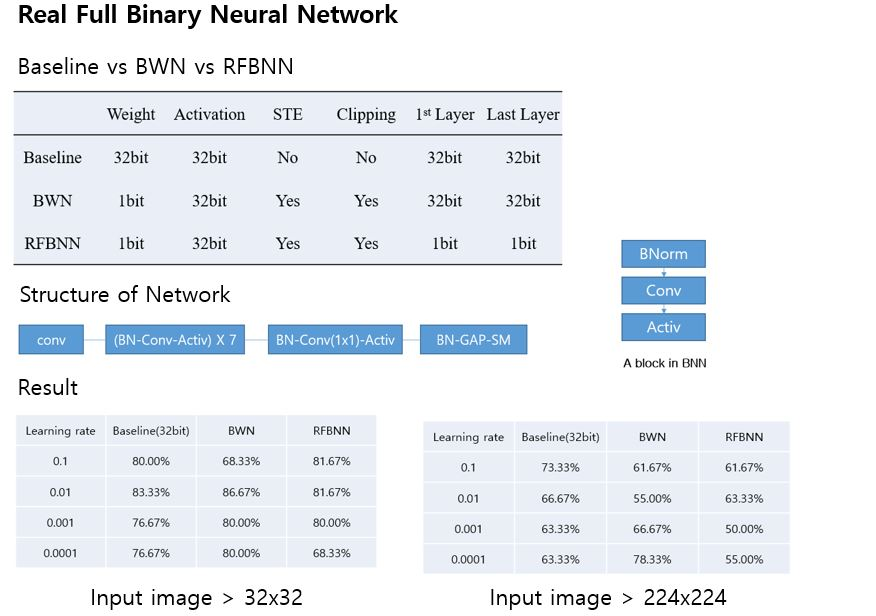

---

---

<h1 id="real-full-binary-neural-netwokrrfbnn---pytorch-version">Real Full Binary Neural Netwokr(RFBNN) - pytorch version</h1>

Requirement --&gt; pytorch , python3 
Our propose

<ul>
<li>Binarize Weight filter( Full precision weight --&gt; binary weight)</li>
<li>delete alpha value</li>
<li>Binarize First and Last layer</li>
</ul>

<h2 id="training--test">Training &amp; Test</h2>

<strong>python3 <a href="http://main.py">main.py</a> --binarize true</strong>

